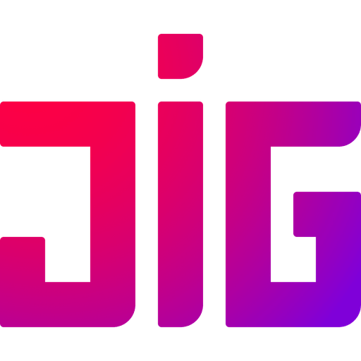
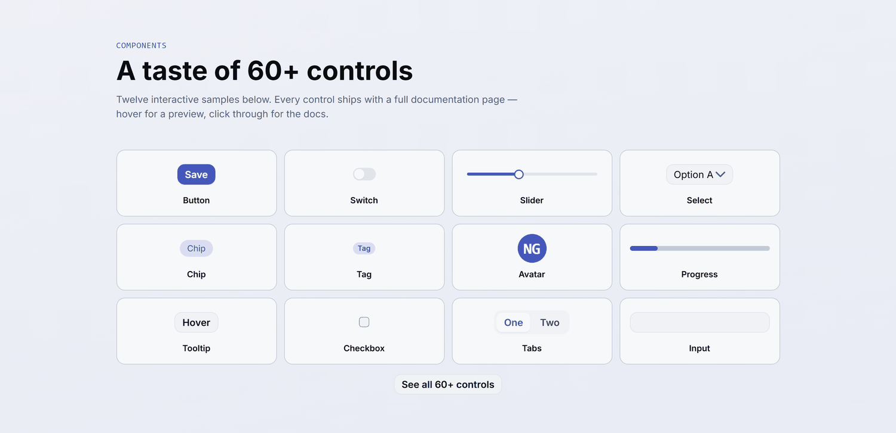
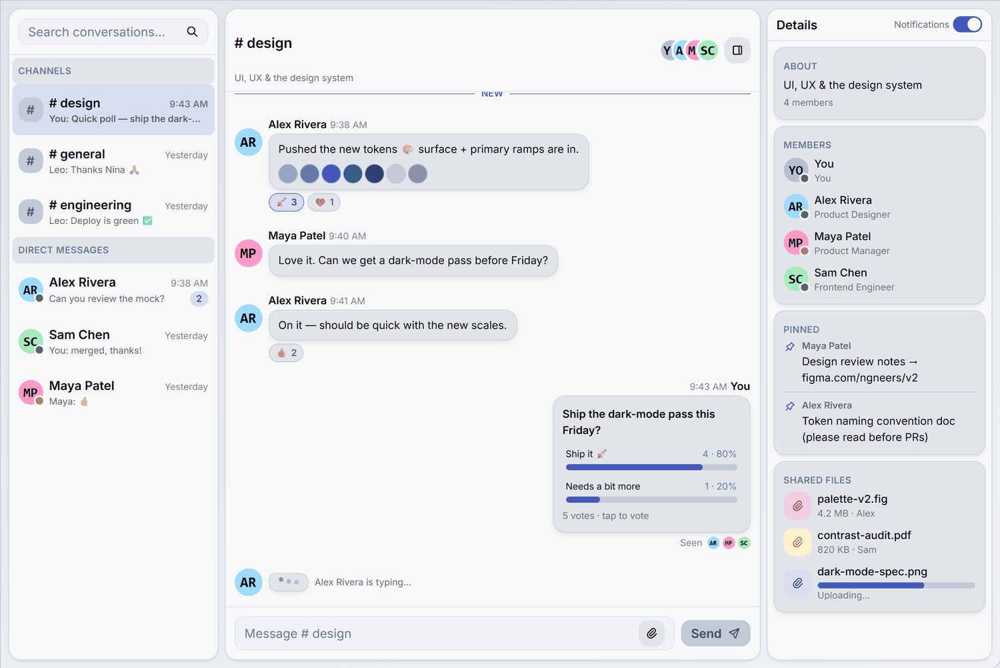
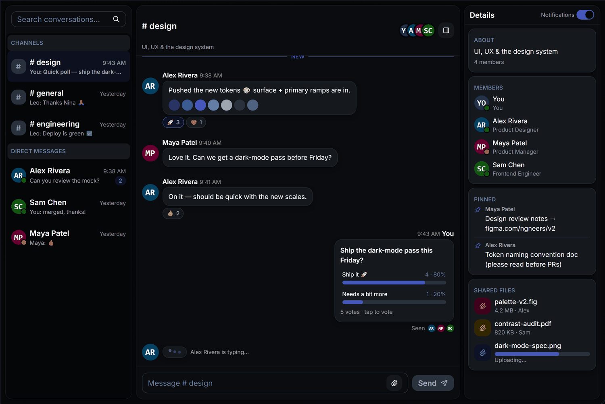
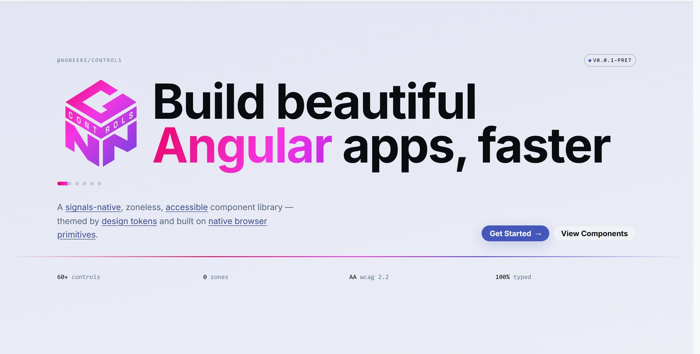

<div align="center">



# @ngneers/controls

**A signal-based component library for Angular 22+**

60+ accessible, themeable, tree-shakeable controls — built the way Angular is heading:
signals everywhere, zoneless, standalone. No `NgModule`s, no `@Input()`/`@Output()`
decorators, no `ControlValueAccessor` boilerplate.

[](https://www.npmjs.com/package/@ngneers/controls)
[](https://github.com/NGneers/controls/actions/workflows/build.yml)
[](https://angular.dev)
[](LICENSE)

### [📚 &nbsp;Everything is on **ngneers.dev** — live demos for every control](https://ngneers.dev)

[](https://ngneers.dev/guides/introduction)
[](https://ngneers.dev/components)
[](https://ngneers.dev/guides/overview)
[](https://ngneers.dev/#demo)

<a href="https://ngneers.dev/#component-gallery">
  <picture>
    <source media="(prefers-color-scheme: dark)" srcset=".github/assets/components-dark.png" />
    
  </picture>
</a>

<sub>Twelve of them. <a href="https://ngneers.dev/components">All 60+ are interactive on the site.</a></sub>

</div>

> **Beta.** Published under the `next` dist-tag. The API is close to stable, but inputs
> may still be renamed between pre-releases — every change ships with a changelog entry.
> Feedback and bug reports are very welcome.

## Why

- **60+ controls** — inputs, actions, overlays, data display (incl. a full-featured
  table), layout, feedback, and navigation.
- **Headless behavior, swappable skin.** Controls ship **zero component CSS**. Behavior,
  accessibility, and named style scopes live in the control; all styling lives in a
  separate **theme** that the engine injects into `<head>` at runtime — no stylesheet to
  import, no Tailwind required.
- **Accessible by default.** WAI-ARIA roles, keyboard interaction, and focus management
  are built in.
- **Three theme presets** — `nova` (fully themed, dark-mode aware), `shade` (a
  shadcn-style theme), and `material` (Material Design 3) — plus a token-driven engine for
  authoring your own.
- **Tree-shakeable.** Every control has its own import subpath; you bundle only what you
  use.

## One app, both schemes

<div align="center">
  <a href="https://ngneers.dev/#demo">
    
    
  </a>
</div>

The same chat app, same markup — list box, avatars, badges, progress, switch, tooltip,
input, buttons. Dark mode is a theme concern, not a per-control one: no `dark:` variants in
your templates, no per-control branching.
[**Drive it yourself →**](https://ngneers.dev/#demo)

## Install

Controls and themes are installed together — the controls hold behavior, the themes hold
styling:

```bash
pnpm add @ngneers/controls @ngneers/controls-themes
```

See the [Installation guide](https://ngneers.dev/guides/installation) for the full installation
instructions including peer dependencies.

## Quick start

Register the provider with a theme preset (the preset is a `Theme` object, not a string):

```ts
import { ApplicationConfig } from '@angular/core';
import { provideNgnControls, withAutoColorScheme } from '@ngneers/controls/api/ng';
import { withDefaultIcons } from '@ngneers/controls/default-icons';
import { nova } from '@ngneers/controls-themes/nova';

export const appConfig: ApplicationConfig = {
  providers: [
    provideNgnControls(
      { theme: { preset: nova } },
      withDefaultIcons(), // opt-in built-in Tabler icon set
      withAutoColorScheme() // opt-in automatic light/dark mode
    ),
  ],
};
```

Then import a control from its subpath and use it — some are elements, some are attribute
directives on native elements:

```ts
import { Component } from '@angular/core';
import { NgnButton } from '@ngneers/controls/button';

@Component({
  selector: 'app-example',
  imports: [NgnButton],
  template: `<button ngnButton kind="primary">Save</button>`,
})
export class ExampleComponent {}
```

[](https://ngneers.dev/guides/introduction)

## Documentation

Configuration, forms, theming, styling, accessibility, SSR, testing and migration guides
all live on the site, next to a runnable example and a props table for every control —
always matching the released version.

[](https://ngneers.dev/guides/introduction)

## Requirements

| Requirement       | Version                                      |
| ----------------- | -------------------------------------------- |
| Angular           | 22.0+                                        |
| TypeScript        | 6.0+                                         |
| Node (build only) | 22+                                          |
| Browsers          | Chrome/Edge 120+, Firefox 129+, Safari 17.5+ |

The browser floors come from the platform features the controls use directly — the popover
API, `@starting-style`, cascade layers and CSS nesting. See
[Browser Support](https://ngneers.dev/guides/browser-support) for the full matrix.

## Packages

| Package                                                   | Description                                           |
| --------------------------------------------------------- | ----------------------------------------------------- |
| [`@ngneers/controls`](packages/controls)                  | The control components and directives.                |
| [`@ngneers/controls-themes`](packages/themes)             | Theme presets (Nova, Shade, Material) and the engine. |
| [`@ngneers/controls-custom-types`](packages/custom-types) | Shared TypeScript type contracts.                     |
| [`@ngneers/controls-mcp`](packages/mcp)                   | MCP server exposing the docs/API to AI coding agents. |
| [`@ngneers/controls-playwright`](packages/playwright)     | Playwright testing harness with page-object helpers.  |

<div align="center">

### Ten minutes on the site beats ten minutes in this README

<a href="https://ngneers.dev"></a>

[](https://ngneers.dev)

</div>

## Contributing

Issues and pull requests are welcome. [CONTRIBUTING.md](CONTRIBUTING.md) covers the repo
layout, the seven parts a control spans, and the conventions we enforce.

- 🐛 [Report a bug](https://github.com/NGneers/controls/issues/new?template=bug_report.yml)
- 💡 [Request a feature](https://github.com/NGneers/controls/issues/new?template=feature_request.yml)
- 🔒 [Security policy](SECURITY.md) — please report vulnerabilities privately
- 🤝 [Code of Conduct](CODE_OF_CONDUCT.md)

## License

[MIT](LICENSE) © NGneers
